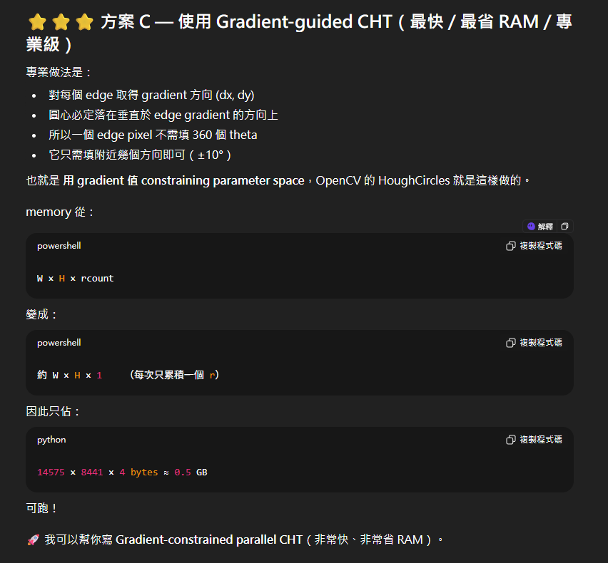
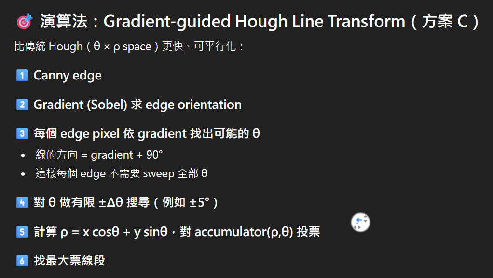

Download opencv and mpi first
```bash
sudo apt update
sudo apt install libopencv-dev 
sudo apt install openmpi-bin libopenmpi-dev

下載銀河圖
wget https://assets.science.nasa.gov/content/dam/science/missions/webb/science/2022/07/STScI-01GA6KKWG229B16K4Q38CH3BXS.png
```

Run code 
```bash
make clean ; make
./<exe file name> -i ../lena.png --mode line(circle)
有些不一樣 先打./<exe file name> 就能看到怎麼寫 在加 --mode line或circle
```

超大解析度的圖(銀河) -> 簡稱 star圖

opencv版本<br>
這是直接用cv2寫好的function<br>
cv2好像有做cpu版和gpu版(cv::cuda)<br>
這裡的是cpu的(我們的proposal好像就是要做cpu的)<br>
我一開始用cv2_version/裡的可以跑 star.png的circle<br>
但我push之前跑一次發現他做circle會直接kill process<br>
我不知道發生什麼<br>

其他版本<br>
後墜有帶star的都是 我發現star圖太大了跑不了 <br>
我叫gpt產一個opencv怎麼實作 就怎麼產給我 (那時候star的circle還能跑)<br>
所以用main_star 才能做star圖<br>

MPI版本<br>
我電腦跑不出來<br>
不懂

現在的問題是<br>
1. 因為opencv已經有實作了 應該人家都弄到最好了 可能也比不贏 所以我也不知道我們要講 以什麼目的來做這份的
    1. 我剛剛想了一下 可能"因為opencv做不了star超大解析 所以我們想弄一個可以跑得並且平行化"的理由來做 雖然做法跟opencv傳統的不太一樣
1. gpt應該做的還算不錯了 我不知道我們要做到怎樣 目前跑起來應該都是沒問題的<br>
    1. 有帶star後墜的main 都寫在上面的<其他版本>
    1. 沒帶star後墜的main 都是跑lena沒問題的 啊因為算法不太一樣 參數也不太一樣 所以結果不太一樣
1. 所以我們可能要想一下要往什麼方向做
    1. 看要只做哪幾種
    1. 然後是要做到多快
    1. 有沒有要跟cv2的現成function比
1. 啊其實我也沒做啥 複製貼上而已 感覺要看一下怎麼做的

## GPT幫我寫的 我沒有很確定寫法有沒有問題 還是得確認一下
## 以下是star後墜的gpt解釋 每個資料夾的readme.md都是star後墜的:<br>

所有程式都使用 OpenCV 讀圖、Canny、Sobel（計算 gradient）並建立 edge list（edge + normalized gradient）。這樣能把參數空間壓到可接受範圍（不會建立巨型 3D accumulator）。

line：gradient → line orientation = grad + 90° → 在 base angle ± window 內投票到 ρ×θ accumulator。

circle：每個 edge 依 gradient 指向（與反向）投票到 center candidate： cx = round(x ± r*nx), cy = round(y ± r*ny)。為節省記憶體，我採「per-radius 2D accumulator」：一次只分配 W*H，針對 single r 投票後掃描，然後釋放，再做下一個 r（與我之前給你的 OpenMP/pthread circle 程式同樣思路）。

每個版本的 voting hot loop 都已被平行化（或使用該後端的並行 API），採用 atomic 增量或 per-thread local buffer（OpenMP & CUDA 使用 #pragma omp atomic / atomicAdd；pthread 使用 GCC 原子 __sync_fetch_and_add；MPI 將 edges 切分，最後 MPI_Reduce 合併）。

每個檔案都有命令列參數方便設定：--mode line|circle, --rmin, --rmax, --rstep, -t threads 等，並會輸出探測結果到 output.png（可用 -o 指定）。

CUDA 檔是 .cu，用 device kernel 在每個 radius 上把 edges 投票到 device accumulator（per-radius allocate/free），投完再把 accumulator 拷回 host 找最大值，雖然每次都同步，但可展示 GPU 加速效果。注意：CUDA 版本需要可用顯示卡與正確安裝的 CUDA + OpenCV（無 CUDA 的 OpenCV 也可，但你要用 nvcc 編譯）。

MPI 版需要 mpicxx 編譯、mpirun -np N 執行。MPI 將 edges broadcast（或 scatter）給 ranks，local 投票後 MPI_Reduce 合併全域 accumulator（line）或每-radius 全局合併（circle）——實作中我讓 rank0 做 final detection + 輸出。

我在每個程式中都把主要時間段（Canny、Gradient 建表、Voting、Total）分別計時並輸出；circle 也會輸出每個 radius 的平均投票時間（可關閉以免輸出過多）。


